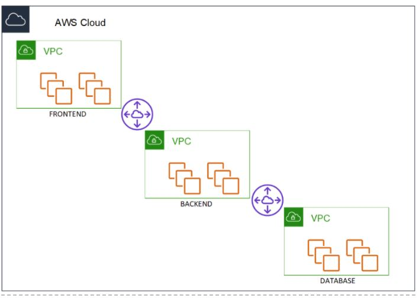
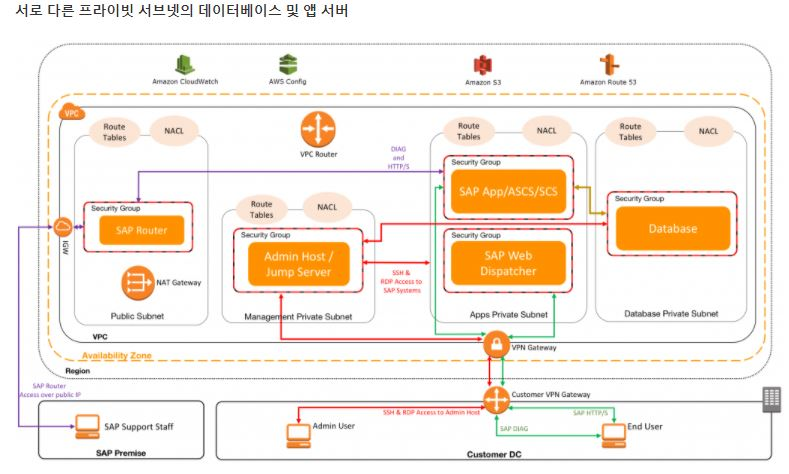

### [ aws vpc설계를 하다가 기존에 vpc는 front, api, admin당 하나씩 생성하게 되었다. ]

각 front,api,admin을 vpc를 별도로 두는것이 궁금해서 찾아봤습니다.
결론은 하나의 vpc에 front, api등을 private subnet으로 구분 지어서 진행하려고 합니다.

 

 
위 그림은 vpc를 환경별로 나눈 예를 이해하기 쉽게하기 위해 추가시킨 그림입니다.

이 방법이 옳은지 찾아봤다. 
* api가 아닌 여러 서비스가 생긴다하면 이 기준으로 하다보면 vpc가 또 생길 것이다. 
* vpc 간 peering이 필요할 것이다.
* 운영간 오버헤드가 존재할 것이다.
    * vpc 피어링 
    * 라우팅 테이블
    * 비용이 더 든다 
* 보안상 좋지 않다.

>좋지 않은 이유는 vpc간 피어링으로 연결이 되어있기 때문에 누군가(해커)가 프론트엔드를 공격한다면, 
vpc간 피어링이 있기에 다른 곳으로 연결하여 공격할 수 있다는 것이다. 
라는 글인데 피어링에서도 route table을 설정해 acl로 보안을 설정할 수 있지않나 생각이 듭니다. 
(아직은 왜 이런 말을 했는지 더 찾아봐야함)

라는 걸 알게 되었고, 좀 더 자세히 어떤 케이스일때 분리하고 어떤 케이스일때 단일 vpc에서 여러 서브넷으로 나누는지 찾아봐야 할 것 같습니다.
 

### 별도의 vpc를 사용할때

* 한 쪽의 보안을 보장할 수 없는 다른 소유자 또는 계정
* CI 시스템 및 프로덕션 인스턴스와 같이 완전히 다른 시스템인 경우
* 기타 다양한 시나리오(더 찾아봐야하겠습니다.)

 

### > 단일 vpc로 사용한다면, 아래 이미지 처럼 분리하려고 합니다.
 

 

* private subnet으로 front, api등을 분리한다
* 보안그룹으로 통신할 구역을 묶는다.

