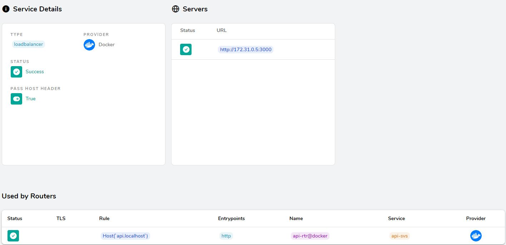

# Traefik으로 container 기반 환경에서 reverse proxy 구성하기


기존에 Nginx, Apache로 프록시하는데 고정된 정보로 했기에 별 다른 어려움이 없었다.
컨테이너 기반의 환경에서 프록시를 하려면 고정된 IP가 아니기에 이를 해결해야하는 문제가 있다.
이 문제를 해결하는 컨테이너 기반 환경에 적합한 소프트웨어를 찾고 알게되었다. <br>

이는 **Traefik**으로 Edge Router라고 불리는 소프트웨어다.
많은 기능을 갖고 있지만, 이번엔 기존 Nginx가 하던 역할인 Reverse Proxy를 Traefik으로 사용해보려고 합니다.  <br><br>


## Reverse Proxy 
---
 우선은 docker를 사용해 container환경을 구성하였고, docker-compose로 컨테이너를 설정하였다.
 1. Traefik을 컨테이너화 한다.
 ```yml
   traefik:
    image: traefik:v2.2
    labels: 
      traefik.enable: true
      traefik.http.routers.dashboard.rule: Host(`dashboard.localhost`)
      traefik.http.routers.dashboard.entrypoints: http
      traefik.http.routers.dashboard.service: api@internal
      traefik.http.services.dashboard.loadbalancer.server.port: 8080
    ports:
      - 80:80
      - 8080:8080
    volumes:
        # traefik.yaml으로 traefik에 대한 설정을 따로해줍니다.
      - .traefik/traefik.yaml:/traefik.yaml
      - /var/run/docker.sock:/var/run/docker.sock:ro
    networks:
      - default
      - internal
 ```
 <br>

 2. traefik에 대한 설정 (traefik.yaml)
 ```yml
 entryPoints:
  # "http" 라는 80포트를 리스닝하는 entrypoint를 생성합니다
  # reverse proxy할 포트번호가 되겠습니다
  http:
    address: :80

providers:
  docker:
    # docker container를 watch하고 있어 컨테이너의 정보를 이용
    watch: true
 ```
 <br>

 3. 각 컨테이너에 대한 설정
 ```yml
 api:
    build: 
    ...
    labels: 
      traefik.enable: true
      # api.localhost라는 host가 요청이오면 아래 3000포트로 프락시를 합니다.
      # entrypoints를 위에서 설정한 http를 사용을 해줘야합니다.
      traefik.http.routers.api-rtr.rule: Host(`api.localhost`)
      traefik.http.routers.api-rtr.entrypoints: http
      traefik.http.services.api-svs.loadbalancer.server.port: 3000
    ...
 ```
 4. 결과화면

 
  결과화면을 보면 설정해준 router룰을 사용해 서비스가 되고있는 3000포트로 연결한다는 것을 보여주고 있습니다.

---
<br>

간단히 설정을 해보면서 Traefik을 reverse proxy를 구성해봤습니다. <br>
물론, 실제 구성은 훨씬 복잡하다. 자주 보는 블로거의 글을 보면 서비스 컨테이너들은 전체 서버의 일부에 배치되고,
로드밸런서는 요청을 처리할 컨테이너가 있는 서버로 유저 요청을 분산해야 하기 때문이라고 하면서, 몇 가지 방법을 설명했습니다. <br>
1. 로드밸런서도 traefik으로 구성해서 동적으로 프록시를 하게한다.
2. 도메인 기반으로 분산한다 이 경우 Nginx나 Apache 기반으로 로드밸런서를 만들 수 있을 것이다.
<br>

라고 포스팅을 한 것을 봤습니다. 이는 추후에 해보면서 습득할 계획입니다. 공부할건 태산인거 같습니다.